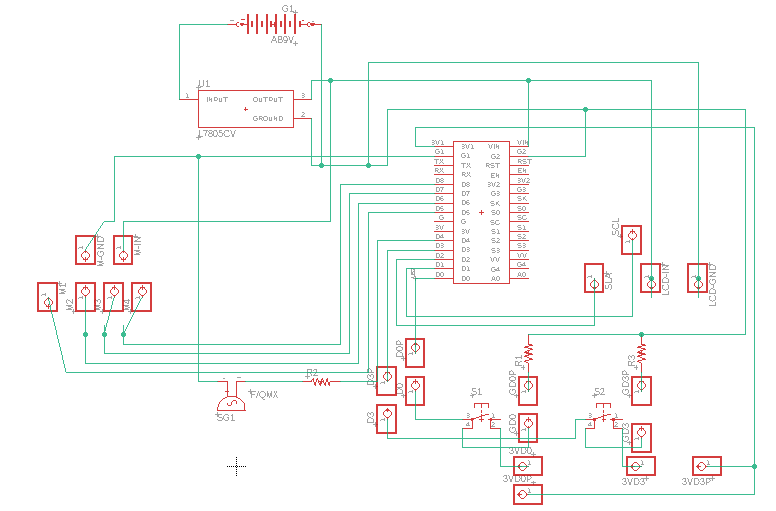
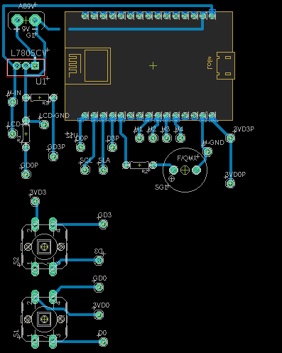

# Hardware

Para o hardware deste projeto, foi desenvolvida uma placa de circuito impresso em cobre para acomodar os componentes.

## Componentes

Os seguintes componentes foram usados:

- ESP8266 NodeMCU
- Motor de Passo 28BYJ-48 com Driver ULN2003
- Display OLED 0.96″ I2C - 128×64
- L7805C Regulador de Tensão 5V
- Push Button
- 3 resistores de 10k
- Buzzer
- Sockets
- Bateria 9V
- Placa de cobre

## Projeto no Eagle

A imagem a seguir demonstra o esquemático desenvolvido no software Eagle para confecção da placa. 

Esta próxima imagem mostra o arquivo Board, onde mostra os componentes em seus respectivos lugares na placa:

Alguns detalhes importantes a serem destacados:

- Na caixa desenvolvida, os botões e o visor estão posicionados voltados para fora, o que exigiu que eles fizessem parte de uma placa separada. Portanto, no esquemático, foram inseridos separadores onde, por meio de jumpers, as trilhas poderiam ser conectadas para interligar essas placas. O mesmo conceito se aplica aos conectores do motor.

## Caixa

Para o projeto, foi criada uma caixa em MDF. Na figura a seguir, podemos observar a estrutura dessa caixa.

Com o objetivo de acomodar os comprimidos, a parte superior foi dividida em 6 compartimentos, com um deles sempre permanecendo aberto, considerado como a posição inicial do motor.

A parte inferior abriga a placa de circuito impresso desenvolvida, que contém os componentes, bem como os botões e o display estão afixados nessa região.